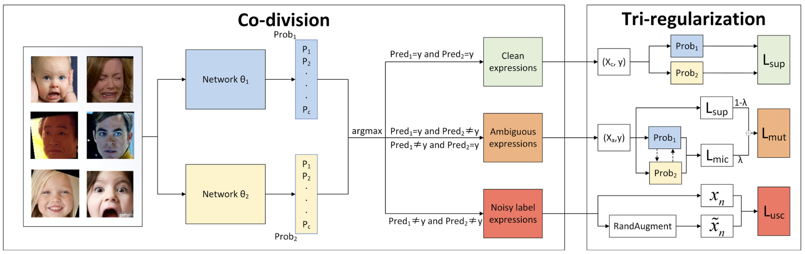

# MAN: Mining Ambiguity and Noise for Facial Expression Recognition in the Wild

The official implementation of the following paper at Pattern Recognition Letters:

**Title:** MAN: Mining Ambiguity and Noise for Facial Expression Recognition in the Wild

**Authors:** Ziyang Zhang, Xiao Sun, Jia Li, Meng Wang

**Institute:** HFUT


## Abstract

Due to the ambiguous expressions and the subjectiveness of annotators, annotation ambiguity is a serious obstacle for facial expression recognition (FER). Ambiguous annotation exists in similar and dissimilar classes, which we call ambiguity and noise. The previous state-of-the-art approaches use uncertainty to generalize the two categories, and adopt uncertainty learning to suppress uncertainty samples. However, ambiguous expressions are confused with noisy label expressions may bias the model toward easy samples and hurt the generalization capability. To solve this problem, we propose a novel approach to mine ambiguity and noise (MAN) in FER datasets. Specifically, we design a co-division module, which divides the datasets into clean, ambiguous and noisy label expressions based on the consistency and inconsistency between the predictions of two networks and the given labels. To effectively learn the clean expressions, improve discriminative ability and avoid memorizing noisy labels, the tri-regularization module employs supervised learning, mutuality learning and unsupervised learning for the three subsets, respectively. Extensive experiments have shown that MAN can effectively mine the real ambiguity and noise, and achieve state-of-the-art performance in both synthetic noisy datasets and popular benchmarks.


## Pipeline




## Train

**Torch**

We train MAN with Torch 1.10.0 and torchvision 0.11.1.


**Dataset**

Download [RAF-DB](http://www.whdeng.cn/RAF/model1.html#dataset), put it into the dataset folder, and make sure that it has the same structure as bellow:

```
- RAF-DB/
         EmoLabel/
             train_label.txt
             test_label.txt
         Image/aligned/
	     			 train_00001_aligned.jpg
             test_0001_aligned.jpg
             ...

```

and modify the `train_label_path`, `test_label_path` and `raf_path` in `main.py`  at line 28~30.


**Pretrained backbone model**

Download the pretrained ResNet18 from [this](https://drive.google.com/file/d/1vqSgtWn-Ud7Od4dOpNB_cutlS4jGA1hQ/view?usp=sharing), put it in the `pretrained_model` dir and modify the `pretrained_backbone_path` in `main.py` at line 31


**Train the MAN**

```python
python main.py
```


**Download the checkpoint**

[RAF-DB 90.51](https://drive.google.com/file/d/1E9GJS-1oAb_RjOPJ2zW5XYwidPx0NZrg/view?usp=sharing)


## Citation

If you use this code in your project or research, please cite using the following bibtex:

```
@article{zhang2022man,
  title={MAN: Mining ambiguity and noise for facial expression recognition in the wild},
  author={Zhang, Ziyang and Sun, Xiao and Li, Jia and Wang, Meng},
  journal={Pattern Recognition Letters},
  volume={164},
  pages={23--29},
  year={2022},
  publisher={Elsevier}
}
```